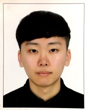

### 이름 : 최정명
### 성별 : 남
### 생년월일 : 1995.10.30
### 국적 : 대한민국
### 직업 : 한림대학교 학부생(4년) 재학중
### e-mail : jeong5905@gmail.com  

# 관심 분야
저는 데이터사이언스, 인공지능, 머신러닝, 딥러닝, 자연언어처리에 관심이 있어 공부중입니다.

# 참여 컨퍼런스
> - 케라스 & 캐글 전국콘서트(서울) 참여 <[관련정보](https://tykimos.github.io/2019/02/09/Keras_and_Kaggle_National_Concert/)>
> - if(kakao) dev2019 (개발자 컨퍼런스) <[관련정보](https://if.kakao.com/about)>
> - DEVIEW 2019 <[관련정보](https://deview.kr/2019)>

# 참가한 온라인 대회 
### [Kaggle](https://kaggle.com)
>-  Humpback Whale Identification (3638/8802 Top 42%)  
>-  ASHRAE - Great Energy Predictor III (1011/3614 Top 28%)  
>-  Santander Customer Transaction Prediction (3638/8802 Top 42%)  
### [Dacon](https://dacon.io)  
>- 금융문자 분석 (153/372 Top 41.1%)
>- 제주 퇴근시간 버스승차인원 예측 (27/269 Top 10.0%)
>- 원자력발전소 상태 판단 (11/192 Top 5.7%)
>- 반도체 박막 두께 분석 (36/228 Top 15.7%)
>- 천체 유형 분류 (7/352 Top 1.9%)

# 활동 (수정중)
> ### 2019
> - 한림대학교 SW 중심대학 Mini 컨트리뷰톤 참가 <1등상 수상> <[관련정보](https://github.com/Hallym-OpenSourceSW/HL_Contributhon)>
> - 강원도 아이디어 해커톤 참여 <장려상 수상> <[관련정보](http://www.provin.gangwon.kr/gw/portal/sub05_02?mode=readForm&boardCode=BDAADD02&articleSeq=157539)>
> - 한림대학교 창업아이디어 경진대회 <은상 수상>
> - 한림대학교 [2019 SW Week] SW 공모전 참여<자연언어 처리 딥러닝 기술을 활용하여 분류기능이 있는 유튜브 다운로드 프로그램> <은상 수상> <[관련정보](https://github.com/JeongMyeong/Youtube-Downloader)>
> - 한림대학교 2019년 2학기 SW 캡스톤디자인<대학교 커뮤니티에 올라오는 질문들을 챗봇을 통해 해결> <금상 수상> <[관련정보](https://github.com/JeongMyeong/Capstone-Design-6-)>
> - 한림대학교 SW골든벨 참가
> - 한림대학교 SW융합대학 2019-1 파이썬언어 멘토링 멘토역할<[관련정보](https://github.com/JeongMyeong/HallymPythonMentoring)>
> - 한림대학교 SW융합대학 2019-2 파이썬을 활용한 머신러닝 멘토링 멘토역할<[관련정보](https://github.com/JeongMyeong/HallymPythonMentoring)>
> - 한림대학교 2019-1 디딤돌 멘토링 멘토역할
> - USC대학(University of Southern California) 에서 진행 된 Software Pioneer Program in AI-based Data Science 교육 수료.
> - Southern California Korean American SoftWare Pioneer Hackathon 참여 및 수료
> - 한동대학교 모형차 자율주행 대회 참여 <[관련정보](https://sites.google.com/handong.edu/sw-2019-car)>
> - CCTV를 이용한 혼잡도 판단 시스템의 제어 방법, 장치 및 프로그램 (특허출원)
> - 2019 한국소프트웨어종합학술대회 논문 발표(Poster)<영화리뷰 감성 분석에서 매개변수 변화에 따른 단어 임베딩 모델의 성능 비교>
> - 창업동아리(CCTV를 이용한 혼잡도)
> - 2019 창업동아리 경진대회 여

> ### 2018
> - 한림대학교 한림 SW 해커톤 참가 <수상>
> - 영화 리뷰를 통한 긍정/부정 리뷰 분류 (캡스톤디자인)
> - Annotation Tool 프로그램 개발 (산학협력프로젝트)
> - 한림대학교 2018-2 디딤돌 멘토링
> - 얼굴과 눈 검출을 통한 졸음 운전방지 프로그램 개발 (영상처리 프로그래밍 프로젝트)
> - 아두이노와 센서를 결합한 물체와의 거리 계산 프로그램 개발(IoT 프로그래밍 강의)

# 수강한 전공 강의
> ### 2019-2
> - 데이터베이스
> - 캡스톤디자인

> ### 2019-1
> - 창의코딩 파이썬
> - 데이터시각화
> - 데이터사이언스
> - 알고리즘 심화
> - 윈도우 프로그래밍
> - 이산구조

> ### 2018-2
> - 머신러닝
> - IoT 머신러닝
> - 텍스트 정보처리
> - 파이썬 프로그래밍 응용
> ### 2018-1
> - IoT 기초프로그래밍
> - 선형대수
> - 영상처리프로그래밍
> - 네트워크
> - 컴퓨터시스템개론
> - 프로그래밍어론
> ### 2017-2
> - C프로그래밍2
> - 멀티미디어
> - 알고리즘개론
> - 인공지능
> ### 2015-1
> - C프로그래밍1
> - 논리설계 및 실험
> - 웹 프로그래밍
> - 자료구조
> ### 2014-2
> - Java 프로그래밍2
> ### 2014-1
> - Java 프로그래밍1

